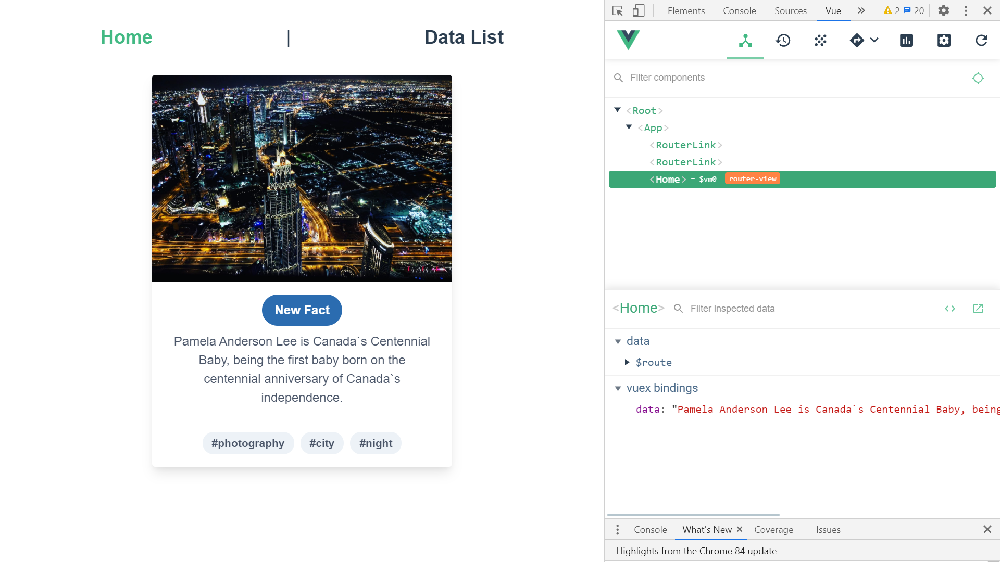
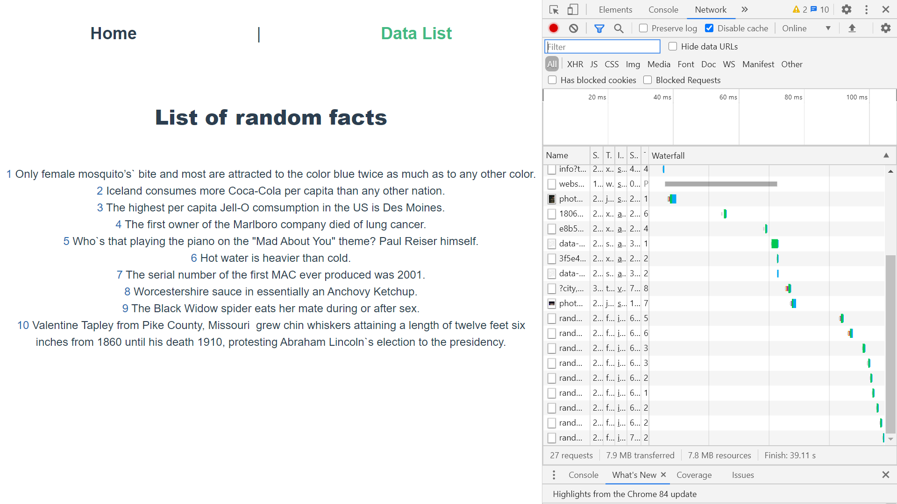

# :zap: Vue Vuex Data

* Vue app to display random fact data using Vuex state management.
* Also shows a random image from [Unsplash](https://unsplash.com/).
* **Note:** to open web links in a new window use: _ctrl+click on link_


## :page_facing_up: Table of contents

* [:zap: Vue Vuex Data](#zap-vue-vuex-data)
  * [:page_facing_up: Table of contents](#page_facing_up-table-of-contents)
  * [:books: General info](#books-general-info)
  * [:camera: Screenshots](#camera-screenshots)
  * [:signal_strength: Technologies](#signal_strength-technologies)
  * [:floppy_disk: Setup](#floppy_disk-setup)
  * [:computer: Code Examples](#computer-code-examples)
  * [:cool: Features](#cool-features)
  * [:clipboard: Status & To-Do List](#clipboard-status--to-do-list)
  * [:clap: Inspiration](#clap-inspiration)
  * [:file_folder: License](#file_folder-license)
  * [:envelope: Contact](#envelope-contact)

## :books: General info

* Data displayed using one-way data-binding and an v-for loop.
* Simple top navigation between random fact shown on a card and a list of facts.
* 'purgecss' was disabled to make this work with the version upgrades. It is not required anyway.

## :camera: Screenshots

.
.

## :signal_strength: Technologies

* [Vue framework v2](https://vuejs.org/)
* [Vue Router v3](https://router.vuejs.org/) the official router for Vue.js
* [Vue CLI v4](https://cli.vuejs.org/)
* [tailwindcss v2](https://www.npmjs.com/package/vue-cli-plugin-tailwind) low-level CSS framework plugin.
* [Simple to use Random facts API](https://uselessfacts.jsph.pl)
* [Vue DevTools extension for Chrome](https://chrome.google.com/webstore/detail/vuejs-devtools/nhdogjmejiglipccpnnnanhbledajbpd)

## :floppy_disk: Setup

* Run `npm i` to install dependencies.
* Run `npm run serve` then navigate to `http://localhost:8080/`. The app will automatically reload if you change any of the source files.
* Run `npm run build` to create a build file

## :computer: Code Examples

* extract from `store/index.js` to control Vuex states

```javascript
export default new Vuex.Store({
  state: {
    currentData: "Random facts display",
    allDatas: []
  },
  mutations: {
    setCurrentData(state, payload) {
      state.currentData = payload;
      state.allDatas.push(payload);
    }
  },
  actions: {
    async setCurrentData(state){
      const data = await fetch(url, { headers });
      const d = await data.json();
      console.log('json data: ', d.items)
      state.commit("setCurrentData", d.text);
    }
  },
  modules: {},
  getters: {
    getCurrentData: state => state.currentData,
    getAllDatas: state => state.allDatas
  }
});
```

## :cool: Features

* Uses Vue & Tailwind CSS for reduced bundle size
* Random image every time app started or screen is refreshed, add API data model

## :clipboard: Status & To-Do List

* Status: Working. Updated june 2021.
* To-Do: Nothing

## :clap: Inspiration

* [Tailwind CSS cards](https://tailwindcss.com/components/cards/)
* [Generate Random Images From Unsplash Without Using The API, June 24, 2018 by Andreas Wik](https://awik.io/generate-random-images-unsplash-without-using-api/)

## :file_folder: License

* This project is licensed under the terms of the MIT license.

## :envelope: Contact

* Repo created by [ABateman](https://github.com/AndrewJBateman), email: gomezbateman@yahoo.com
